# Обновлённый участок — реальные снимки игры

В этой версии дежурный получил округлую модель, коридор первого этажа продолжен к лестнице в медицинский подвал, все шесть кабинетов заменены объёмными комнатами. В коридорах и кабинетах работает одинаковое управление: WASD, обзор мышью, Е или ЛКМ для двери и предмета.

Это снимки настоящих игровых моделей в браузере. Изображения не сгенерированы и не ретушированы; используются материалы, свет и тени игры. Общие виды комнат и этажей сняты с доступных игроку позиций. Крупный план дежурного служит для осмотра модели.

## Дежурный

Округлая анатомия основана на присланной Universal Base. Новая форма имеет цельную поверхность от торса до манжет, полицейскую фуражку, воротник, галстук и эмблемы. Исходные 65 костей сохранены; дежурный печатает пальцами, моргает, дышит и поворачивается к монитору. При переделке пересчитаны нормали изменённой одежды и удалены закрытые формой полигоны, которые пересекали её поверхность.

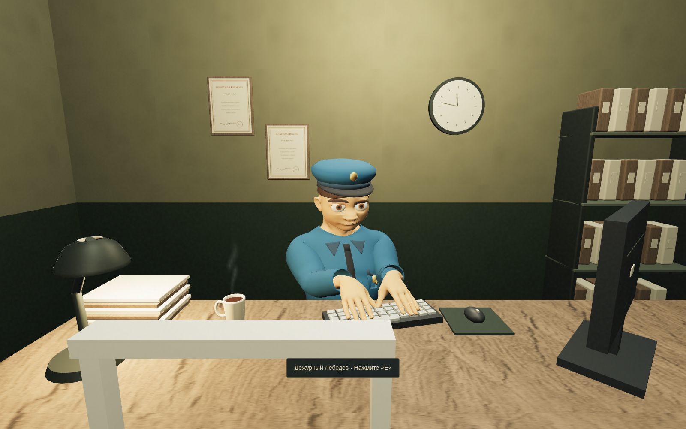

## Продолжение коридора и морг

На первом этаже существующая лестница наверх остаётся у поворота. Прямой проход продолжается к отдельному спуску. По лестнице можно пройти в обе стороны обычным движением. За металлической дверью «МОРГ» находится оборудованная комната судебной медицины.

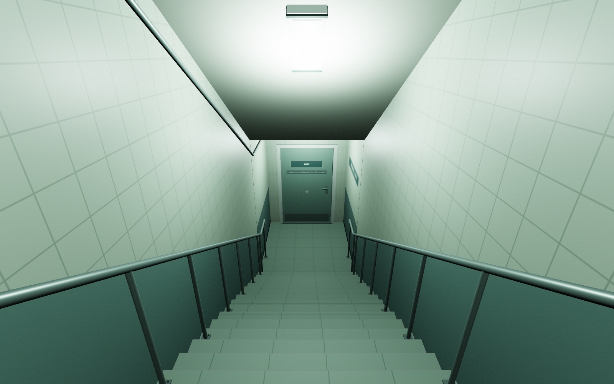

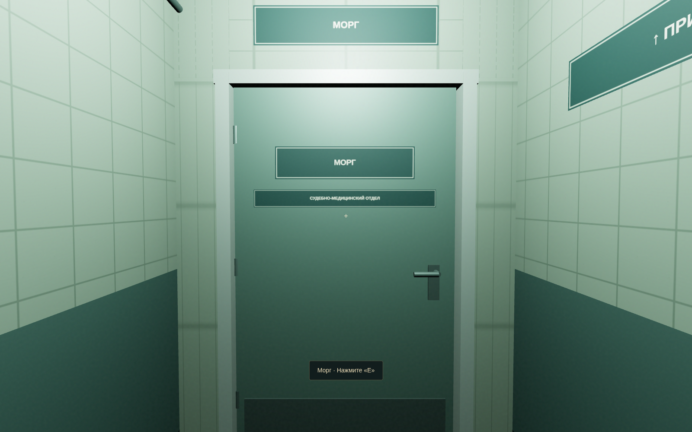

Секционный стол имеет слив, бортики, промывку, опоры и поперечины. Рядом — инструментальная тележка, осмотровый светильник на шарнирной подвеске, девять холодильных камер, шкафы, мойка, журнал поступлений и компьютер. Предметы и документы доступны для осмотра.

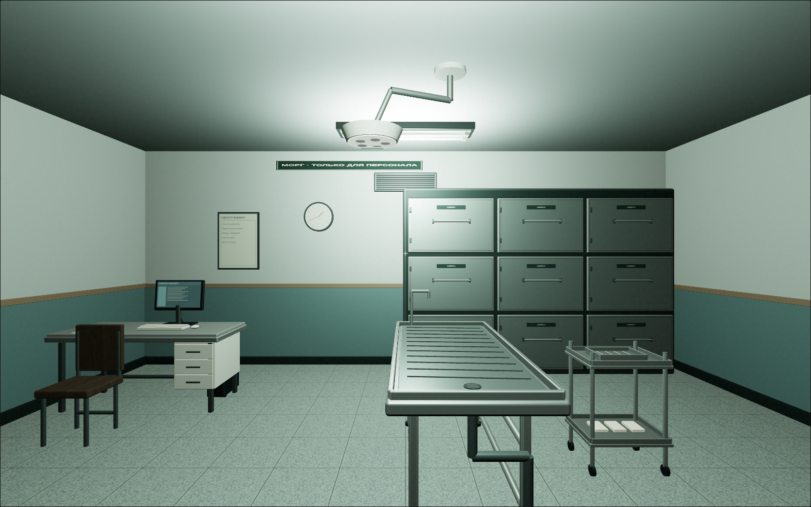

## Кабинеты

Кабинет следователя: рабочий стол, компьютер, папка дела, телефон экспертизы, доска улик, шкафы и кресло посетителя.

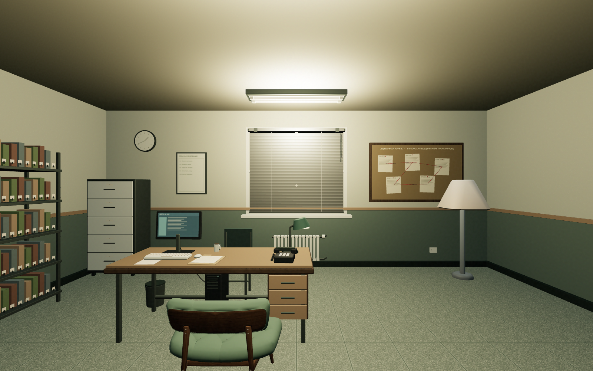

Допросная: анимированная Соколова, протокол, материалы дела, аппаратура записи, камера наблюдения, тренировочная обувь и боксёрские перчатки.

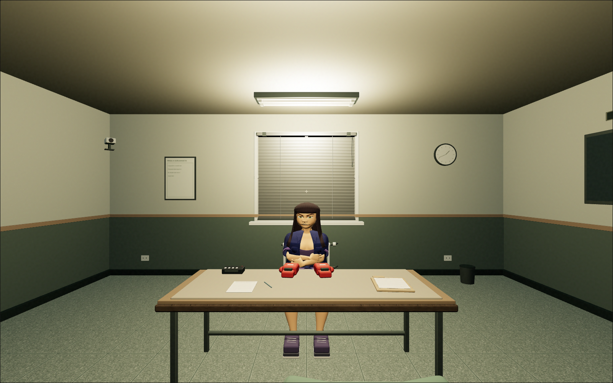

Архив: ряды папок, картотека, журнал выдачи дел и карта маршрутов.

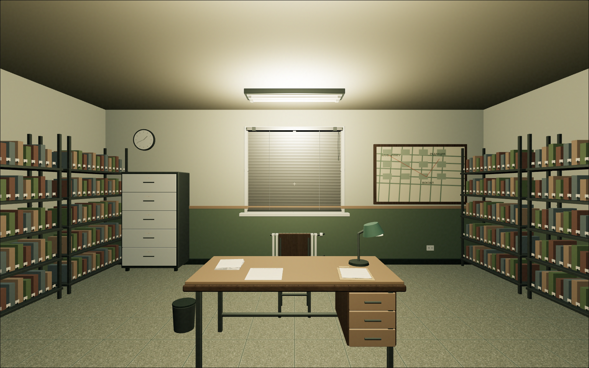

Лаборатория: микроскоп, маркированные образцы, рабочий терминал, вытяжной шкаф и мойка.

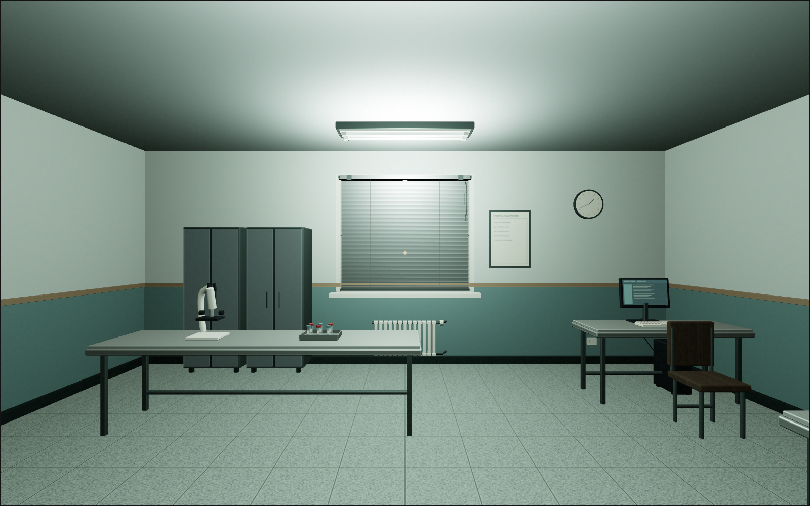

Хранилище улик: сетчатые шкафы, опечатанные пакеты, журнал передачи и компьютер учёта.

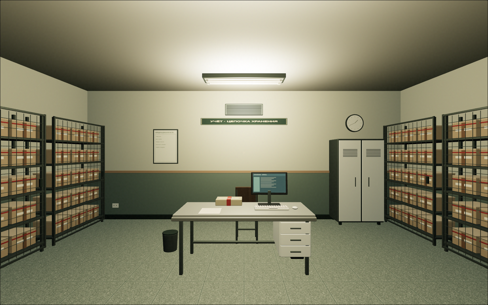

Комнаты имеют собственные стены, потолки, свет и препятствия. Вход через дверь переводит игрока в отдельную 3D-секцию; обратная дверь возвращает точно к исходной позиции и направлению взгляда в коридоре. Непрерывного прохода через порог пока нет.

## Жалюзи и отделка

На втором и третьем этажах установлены четыре комплекта металлических жалюзи; ещё четыре работают на окнах кабинетов. Е или ЛКМ плавно поднимает ламели под верхнюю направляющую; повторное нажатие закрывает их. Движение длится 1,35 секунды, направление можно поменять до его окончания.

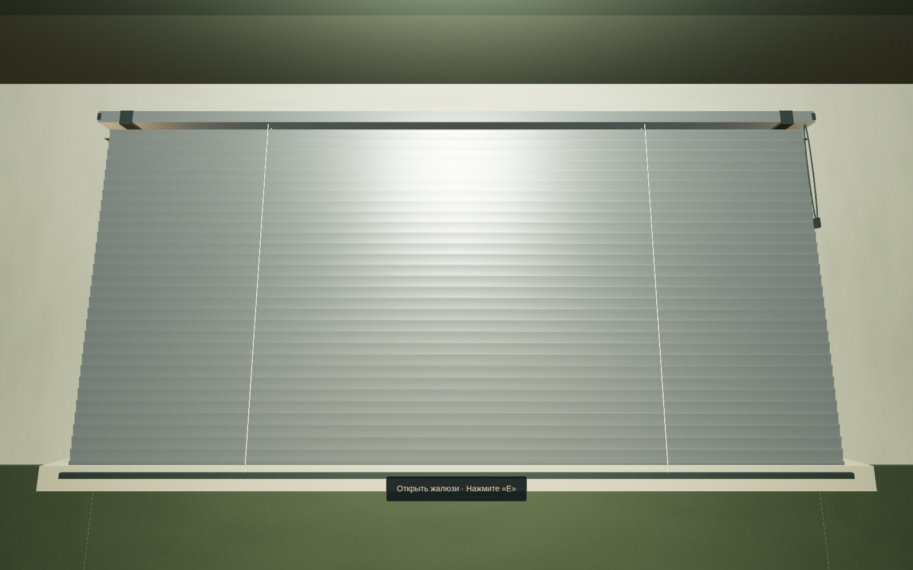

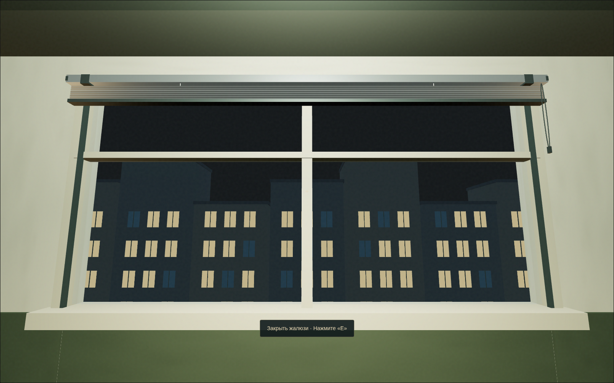

У этажей различаются отделка и палитра: зелёная дежурная часть с состаренной плиткой, тёплый этаж следствия с терраццо, прохладный экспертный отдел. Добавлены плинтусы, вентиляция, кабель-каналы, крепления и сдержанный износ поверхностей.

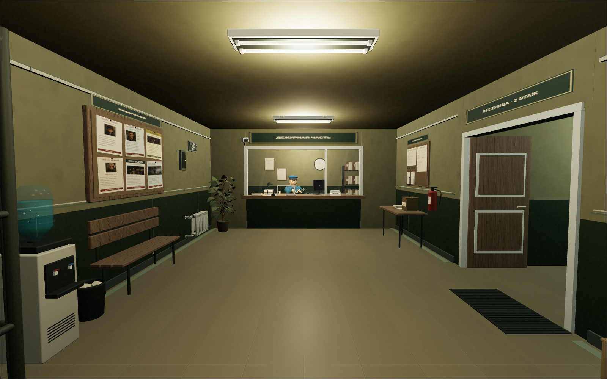

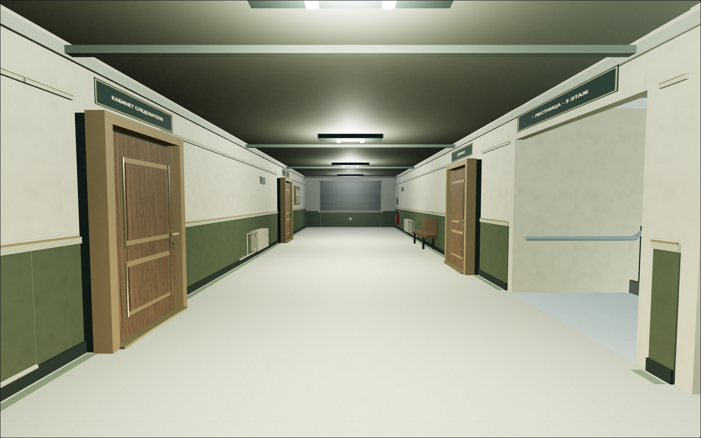

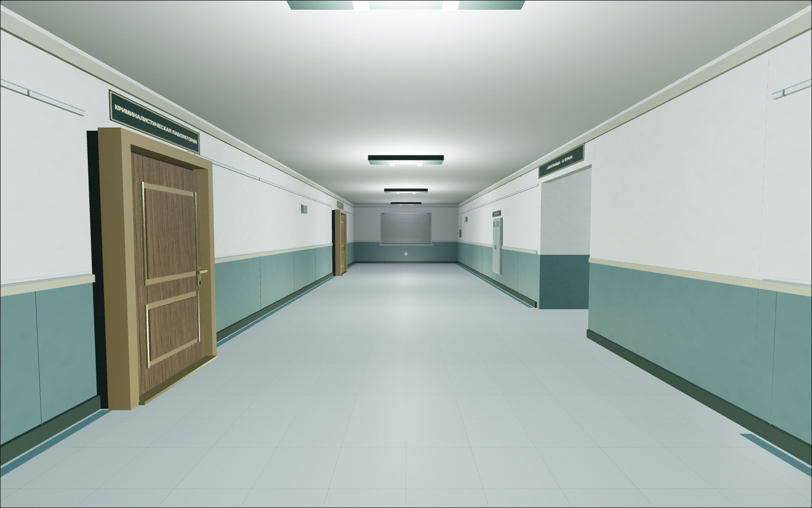

## Проверка

- Все 16 тестов проекта прошли, включая непрерывные маршруты между этажами, новый спуск и ограничения закрытых дверей.
- Браузерная проверка охватила свободное появление и движение в шести комнатах, столкновения с мебелью, осмотр 13 документальных объектов и возврат через физическую дверь.
- Папка, доска улик, предъявление журнала Соколовой, телефонная экспертиза и финальное обвинение проверены через игровые Е/ЛКМ. Дело достигает исхода «Дело раскрыто».
- Спуск и подъём в подвал проверены непрерывным WASD с покадровым измерением высоты; скачков на другой этаж не обнаружено.
- Жалюзи проверены при открытии и закрытии через Е/ЛКМ, включая промежуточные положения и конечные точки. Вид на улицу дополнительно проверен обычным непрерывным рендером игры.
- У дежурного проверены исходная иерархия 65 костей, нормализованные веса, конечность координат и движения в нескольких фазах печати и отдыха.
- Интернет-ресурсы проверены загрузкой GLTFLoader/WebGL; используются локальные копии с CC0. [Авторы, источники и изменения](station-asset-sources.md).
- Готовый ZIP распакован и проверен через обычный интерфейс игры: вход и возврат из кабинета, разговор с дежурным и восстановление управления, загрузка трёх NPC и мебели. Все девять проверок прошли без ошибок JavaScript и отсутствующих ресурсов. [Отчёт с SHA-256 архива](station-production-validation.json).

Производственная сборка упакована вместе с моделями, текстурами и лицензиями. Для запуска полностью распакуйте [игру](../releases/night-shift-game.zip) и откройте `Start-Game.bat` на Windows.
